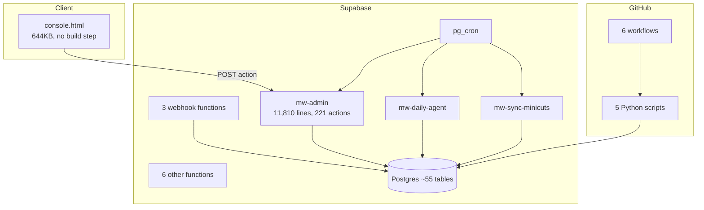

# Current Architecture

## Shape

There is no application server. A static HTML file calls Deno edge functions
directly. Postgres holds everything. GitHub Actions runs Python.

## Deployed functions

**UNKNOWN in this repository copy.** The working copy contains 8 function
folders; the deployed project has 13. The following are deployed but not present
here: `mw-ingest`, `mw-ml`, `mw-resolve-duplicates`, `mw-scheduled-publish`,
`whatsapp-config`. A stray `whatsapp-webhook` (no `mw-` prefix) was deployed by
mistake and should be deleted after confirming nothing at Meta points to it.

| Function | Role | Auth |
|---|---|---|
| `mw-admin` | 221 actions behind one POST | JWT; cron secret for 5 actions |
| `mw-daily-agent` | Decision engine, no LLM | Cron secret |
| `mw-sync-minicuts` | Nightly pull from booking system | Cron secret |
| `mw-whatsapp-webhook` | Inbound messages, receipts | Meta signature |
| `mw-instagram-webhook` | Instagram DMs | Meta signature |
| `mw-leads-webhook` | Lead Ads | Meta signature |
| `send-whatsapp` | Sends one message | Tenant API key |
| `whatsapp-templates` | Template creation | JWT |

## Why three functions duplicate mw-admin

`mw-scheduled-publish`, `mw-resolve-duplicates` and `mw-ingest` mirror actions
that exist in `mw-admin`. They are separate because `mw-admin` requires a user
session on every action and a scheduled job has none. Merging them without
replacing that auth path will break the schedules.

## Frontend

One file, three inline `<script>` blocks, no framework and no build. Pages are
divs toggled by `showPage()`. Four fetch helpers — `call`, `callWA`, `callIngest`,
`callML` — guarantee response shape so a missing field does not throw.

**Consequence:** no module boundaries. A function defined twice silently uses the
later definition. This has occurred at least four times. See
[KNOWN_RISKS_AND_TECHNICAL_DEBT.md](KNOWN_RISKS_AND_TECHNICAL_DEBT.md).

---

**Last verified:** 2026-09-01  
**Evidence:** `supabase/functions/`, `console.html`; deployed function list from the Supabase dashboard, supplied 2026-08-31
