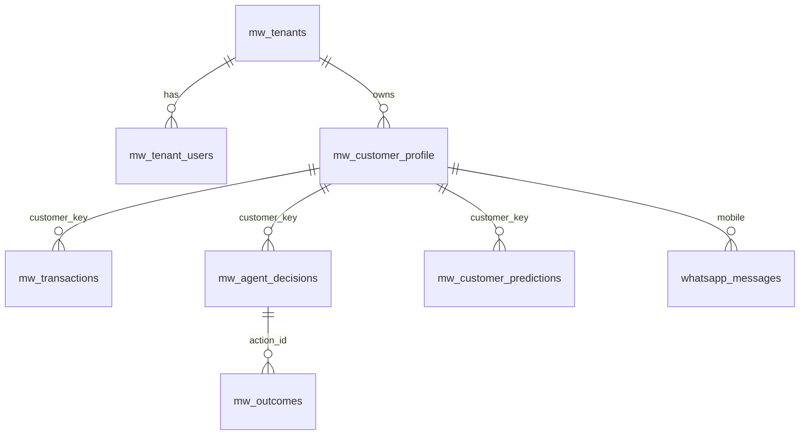

# Data Model

~55 tables. Every one carries `tenant_id` and every query filters on it.

## Identity — the most important decision here

```
customer_key = lower(trim(mobile)) + "|" + lower(trim(name))
```

Not phone alone. Siblings share a parent's number, and a phone-only key merges
their visit histories and loyalty counts into one child. The name comes from the
salon's master customer record, not the per-visit check-in field, which varies
between visits.

Defined in `supabase/functions/mw-sync-minicuts/index.ts`.

## Core entities



| Table | Holds | Join key |
|---|---|---|
| `mw_tenants` | One row per business. Currency, cooldown, reply settings. | `id` |
| `mw_tenant_users` | Who may access which business | `tenant_id`, `user_id` |
| `mw_customer_profile` | Customer. Segment, `dob`, `stamps`, `dnd`, `opted_out_at` | `customer_key` |
| `mw_transactions` | Every visit. Service, amount, stylist, `checkin_at`, `called_at`, `done_at` | `customer_key` |
| `mw_agent_decisions` | Decision and reason. Status drives the dispatcher. | `customer_id` |
| `whatsapp_messages` | Both directions. Delivery status exists only here. | `mobile` |
| `mw_customer_predictions` | Nightly scores: `tier`, `probability` | `customer_key` |
| `mw_outcomes` | What was done and what came of it — training data | `customer_key` |

## Naming trap

`mw_agent_decisions.customer_id` **holds a `customer_key`, not an id.** Every
join depends on it. Renaming requires migrating every reference.

## Status values on `mw_agent_decisions`

| Status | Meaning |
|---|---|
| `pending_review` | Waiting for approval |
| `approved` | Approved but not yet dispatched. **Nothing retries these.** |
| `scheduled` | Picked up by the dispatcher |
| `sent` / `auto_sent` | Delivered to Meta |
| `rejected` | Declined |
| `holdout` | Deliberate control group — never messaged |
| `skipped_duplicate` | Blocked by the cooldown at send time |

## Operational tables

`mw_llm_calls` (every model call with cost), `mw_auto_replies` (every reply
decision including declines), `mw_agent_runs`, `mw_tenant_credentials`
(AES-GCM encrypted), `mw_model_prefs`, `mw_agent_notices`, `mw_salon_photos`,
`mw_carousel_slides`.

## Retention

| Data | Policy |
|---|---|
| Generated images | 30 days, then deleted and `expired_at` set |
| Everything else | **Indefinite. No policy.** |

## Tables referenced in code that do not exist

**UNKNOWN / BROKEN:** `mw_predictions` and `mw_message_templates` are queried in
`mw-admin` and are not in the database. Whichever features use them return
nothing and treat that as empty. Audit before relying on either.

## Row-level security

Established: `mw_tenant_users` and `mw_tenants`, both `SELECT WHERE
mw_is_tenant_member(...)`. `mw_is_tenant_member` is `SECURITY DEFINER` — without
that the policy is circular.

**UNKNOWN:** policies on the other ~53 tables were not enumerated. Most access
uses the service-role client, which bypasses RLS entirely, so isolation
currently depends on application code remembering `.eq("tenant_id", ...)`.
This must be resolved before a second tenant. See
[ADR-0004](adr/ADR-0004-AUTHENTICATION-AND-TENANT-ISOLATION.md).

---

**Last verified:** 2026-09-01  
**Evidence:** `supabase/*.sql` (45 migrations), `supabase/functions/*/index.ts`; RLS from migrations only.
