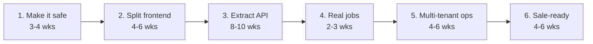

# Migration Plan

Ordered by **risk removed**, not features delivered. The current platform keeps
running throughout — nothing here requires switching it off.

## Phase 1 — Make it safe to change (3–4 weeks)

**Nothing is rewritten. Everything becomes verifiable.**

- [ ] Second Supabase project as staging, secrets duplicated
- [ ] GitHub Actions deploying functions and console — no more laptop deploys
- [ ] Sentry on console and functions
- [ ] Failure alerts on every cron path and workflow
- [ ] Console smoke test in CI (see [TESTING_STRATEGY.md](TESTING_STRATEGY.md))
- [ ] RLS audited and applied on all ~55 tables
- [ ] Verify deployed function source matches git

*Why first: everything after is safer once it exists, and none of it requires the
rewrite to have started.*

## Phase 2 — Split the frontend (4–6 weeks)

- [ ] React + Vite + TypeScript, one component per card
- [ ] Generated API client — a renamed field breaks the build, not the page
- [ ] Existing console stays live until the new one is complete

*Why second: highest-irritation problem, self-contained, and it forces the API
surface to be written down.*

## Phase 3 — Extract the API (8–10 weeks)

- [ ] NestJS, containerised, running locally and in CI
- [ ] Modules per [ADR-0002](adr/ADR-0002-SERVICE-BOUNDARIES.md), migrated one at a time
- [ ] `mw-admin` proxies to the new service per action — incremental and reversible
- [ ] Tests written as each module moves, not retrofitted

*Why third: the biggest piece, and doing it after Phase 1 means a mistake is
caught in staging rather than by a customer.*

**This is the riskiest phase.** Everything else is additive; this one replaces
something that works.

## Phase 4 — Real jobs (2–3 weeks)

- [ ] BullMQ + Redis replacing pg_cron
- [ ] Retries with backoff, dead-letter queues, visible job history
- [ ] Per-tenant daily send cap enforced in the queue

*Why here: pg_cron cannot retry and reports success when a job 401s.*

## Phase 5 — Multi-tenant operations (4–6 weeks)

- [ ] Self-service onboarding: sign up, connect WhatsApp, import customers
- [ ] Generalise the sync — `mw-sync-minicuts` is shaped around one schema
- [ ] Per-tenant configuration where prompts hardcode MiniCuts
- [ ] Billing, usage metering, plan limits
- [ ] Cross-tenant admin view

## Phase 6 — Ready to sell (4–6 weeks)

- [ ] SOC 2 groundwork: audit logging, access review, change management
- [ ] Per-tenant data export and deletion
- [ ] Documented RPO/RTO with a restore actually tested
- [ ] Rate limiting and API versioning
- [ ] Status page

## Estimate

| | |
|---|---|
| Elapsed | 6–9 months with one strong full-stack engineer; 4–5 with two |
| Infrastructure at 100 tenants | ~$400–800/month |
| AI at 100 tenants | ~$200–400/month |

*Assumes the existing code is treated as a specification rather than something to
preserve. Most of Phase 3 is moving working logic into a testable structure — not
deciding what it should do.*

---

**Last verified:** 2026-09-01  
**Evidence:** Phasing agreed 2026-08-31; estimates are judgement, not measurement.
