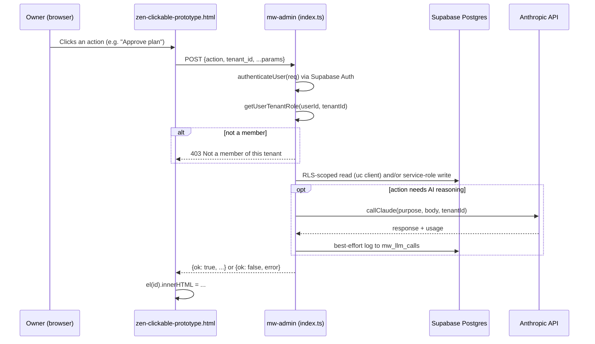
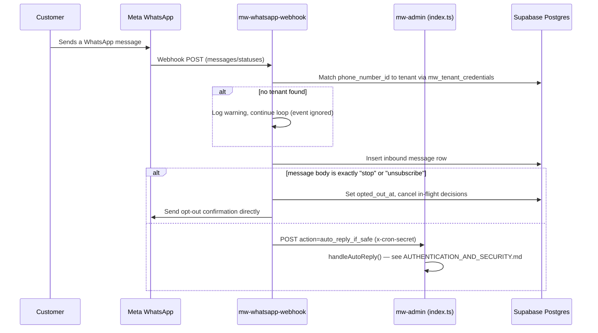
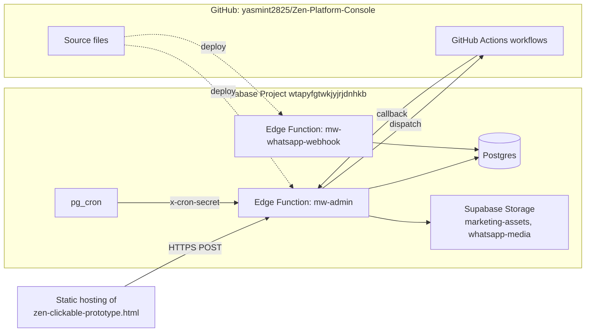

# Current Architecture

[← Back to index](./README.md)

## Is it really "flat"? Yes — one honest confirmation

This is not a loosely-coupled set of services wearing a flat label. It is genuinely one backend file (`index.ts`) implementing 243 distinct actions in a single `switch` statement inside one `Deno.serve()` handler, all sharing one Supabase service-role client (`const supabase = createClient(...)`, module scope, `index.ts:16`). There is no internal service boundary of any kind today — WhatsApp messaging, ad spend analysis, AI content generation, customer prediction, and billing all execute in the same process, same request handler, same database connection pool.

This matters directly for [TARGET_ARCHITECTURE_ALIGNMENT.md](./TARGET_ARCHITECTURE_ALIGNMENT.md) and the proposed [ADR-0002](./adr/ADR-0002-SERVICE-BOUNDARIES.md) — there is no existing seam to exploit; any service boundary in the target architecture will be a genuine extraction, not a promotion of something already separated.

## Request flow — a typical owner action

## Request flow — inbound WhatsApp message

## Deployment topology

**[UNKNOWN — where `zen-clickable-prototype.html` is actually hosted in production is not evidenced in the file itself; confirm the real static hosting setup with the team before treating the diagram above as complete.]**

## Internal organization of `index.ts` (since there's no folder structure to map)

The file is organized top-to-bottom as:
1. Constants and small pure helpers (currency formatting, mobile number normalization, JSON repair, etc.) — roughly lines 1–450
2. Shared functions used by multiple actions — `gatherMarketingInsights`, `compilePromptForBrief`, `applyAdChange`, `runAdSchedule`, `dayPerformance`, `callClaude`, `sendWhatsappTemplate`/`sendWhatsappText`, `loadServiceList`, `loadStaffAvailability`, `handleAutoReply`, `resolveMetaAds`, `approveAndSendDecision` — roughly lines 450–2300
3. The `Deno.serve()` handler: auth, tenant resolution, then the 243-case `switch(action)` — the bulk of the file, ~2300–13300
4. A second, smaller set of helpers specific to the `ask_question` AI tool-use loop (`ASK_TOOLS`, `executeAskTool`, `runSandboxedQuery`) — near the end

There are no internal module boundaries (no separate files for "campaigns" vs "ads" vs "content") — grouping is by comment header only, and even that is inconsistent in places (see [CODEBASE_MAP.md](./CODEBASE_MAP.md)).

## Key architectural patterns actually in use

- **One shared send path.** Every non-one-off WhatsApp send (manual approve, bulk approve, wave commits, the scheduled dispatcher) funnels through a single function, `approveAndSendDecision` (`index.ts`), specifically so safety checks (cooldown, opt-out) only need to be enforced once. This was a deliberate fix during development after an opt-out gap was found in paths that didn't go through it.
- **RLS-enforced reads, service-role writes.** `userClient(req)` creates a per-request client running as the calling user's own JWT for reads, so Postgres Row-Level Security — not application code — is the actual tenant-isolation boundary for reads. Writes go through the module-level service-role `supabase` client after an explicit role check. This is a real, meaningful defense-in-depth pattern, not just a comment claiming one.
- **Pagination discipline.** A single helper, `fetchAllPages`, is used everywhere a table could plausibly exceed Supabase's default ~1000-row cap. This was added after a real production bug (undercounted lapsed customers) traced to an unbounded `.select()`.
- **Cron authentication is a narrow allow-list**, not a blanket bypass — `CRON_ACTIONS` (`index.ts:2322`) names exactly which actions may authenticate via `x-cron-secret` instead of a user session.
