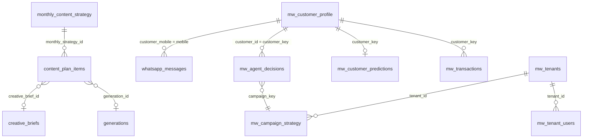

# Data Model

[← Back to index](./README.md)

**No SQL schema files exist in this repository.** Everything below is inferred from how `index.ts` queries and writes each table — real, but incomplete. The authoritative schema lives in the Supabase project itself (`wtapyfgtwkjyjrjdnhkb`), not in this codebase. **[UNKNOWN — column types, foreign keys, and indexes should be confirmed directly against the live database or a schema export before relying on this document for anything migration-critical.]**

## Grouped by real function (72 tables total)

**Customers & transactions (core, un-prefixed)**
`customers`, `historical_transactions`, `mw_transactions`, `mw_customer_profile`, `mw_customer_predictions`

**Campaign engine**
`mw_agent_decisions`, `mw_campaign_strategy`, `mw_agent_runs`, `mw_agent_notices`, `mw_blackout_periods`, `mw_custom_audiences`

**WhatsApp**
`whatsapp_messages`, `mw_auto_replies`, `mw_business_facts`, `mw_package_priority`, `mw_package_suggestions`, `mw_template_map`, `mw_tenant_credentials`, `mw_stylists`

**Marketing / content generation**
`monthly_content_strategy`, `content_plan_items`, `creative_briefs`, `mw_creative_briefs`, `generations`, `generation_feedback`, `assets`, `brand_profiles`, `brand_rules`, `business_strategy`, `mw_brand_settings`, `mw_carousel_slides`, `mw_salon_photos`, `mw_social_posts`, `mw_mascot_candidates`, `mw_canva_connection`

**Meta Ads**
`mw_ad_actions`, `mw_ad_analysis_cache`, `mw_ad_insights`, `mw_ad_leads`, `mw_ad_plan_phases`, `mw_ad_rules`, `mw_creative_attributes`, `mw_creative_learnings`, `mw_competitors`, `mw_competitor_research`

**Analytics / intelligence**
`mw_analytics_snapshot`, `mw_daily_metrics`, `mw_daily_intelligence`, `mw_insights_history`, `mw_metric_learnings`, `mw_load_forecast`, `mw_campaign_performance_snapshot`, `mw_stylist_performance_snapshot`, `mw_outcomes`, `mw_llm_calls`, `mw_query_audit_log`

**Platform / tenancy**
`mw_tenants`, `mw_tenant_users`, `mw_tenant_invites`, `mw_tenant_api_keys`, `mw_strategy_audit_log`, `mw_model_prefs`, `mw_prompt_templates`, `mw_metrics`

(Remaining tables not individually categorized here — see the raw list via `grep -oE 'from\("[a-z_]+"\)' index.ts | sort -u` for the complete, current set; this list will drift from the live schema faster than this document is likely to be updated.)

## The one identity concept every developer must understand

`customer_key` is **not** the same as a customer's phone number. It's a phone+name composite identity — this is what correctly separates siblings sharing one parent's phone number, a real scenario in a children's salon. Several tables carry both `customer_id`/`customer_key` (the composite identity) and a raw `mobile`/`customer_mobile` field (the phone number alone, needed because messaging happens by phone number regardless of which sibling a message is about). Conflating these two was a confirmed source of bugs during development — a "returning family being treated as new" incident was traced directly to a lookup using `.maybeSingle()` against a phone number that matched multiple siblings.

## Cross-table relationships actually observed in queries (not a formal ERD — none exists)

Every table above also carries a `tenant_id` column (confirmed via the `.eq("tenant_id", tenant_id)` filter present on effectively every query in `index.ts`) — this is the real multi-tenancy mechanism, enforced both by application-level filtering and by Postgres RLS on the RLS-scoped read client (see [AUTHENTICATION_AND_SECURITY.md](./AUTHENTICATION_AND_SECURITY.md)).
