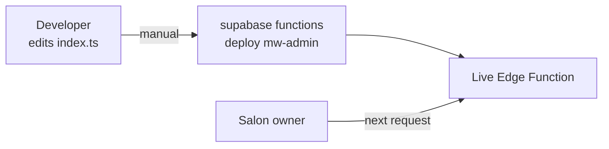

# Deployment Runbook

[← Back to index](./README.md)

## The only confirmed deployment mechanism: manual CLI deploy

```
supabase functions deploy mw-admin --no-verify-jwt
```

This is documented directly in the source (`index.ts:7`). **No CI/CD pipeline (GitHub Actions deploy workflow, or otherwise) automates this today** — every deployment observed during this project's development was a manual `supabase functions deploy` run, confirmed repeatedly by the pattern of "please deploy this and confirm" across development sessions.



## A confirmed, real deployment gap that caused repeated incidents

During development, "the fix isn't showing up" was traced multiple times to the backend simply not having been redeployed after a code change — the frontend file (a static HTML file, effectively "deployed" the instant it's saved/reopened) and the backend (requiring an explicit CLI deploy step) were repeatedly out of sync, with the person testing sometimes on an old frontend, sometimes against an old backend, sometimes both. **Any new deployment process for the target architecture should treat "frontend and backend can silently drift out of sync" as a real, previously-observed failure mode to design against**, not a hypothetical risk.

## No automated rollback

**[UNKNOWN — no rollback procedure is documented or evidenced anywhere in this repository.]** Supabase Edge Functions support redeploying a previous version via the CLI/dashboard, but no project-specific rollback runbook exists. This is a genuine gap for [KNOWN_RISKS_AND_TECHNICAL_DEBT.md](./KNOWN_RISKS_AND_TECHNICAL_DEBT.md).

## Environments

**[UNKNOWN — only one Supabase project ID (`wtapyfgtwkjyjrjdnhkb`) appears anywhere in prior project context. No evidence of separate staging/production environments exists in this repository.]** If a staging environment exists, it is not referenced anywhere in the code (no environment-conditional logic, no separate project ID handling).

## Database migrations

**No migration files exist in this repository.** Every schema change during this project's development was communicated as a standalone SQL snippet (in conversation, not committed anywhere) for manual execution in the Supabase SQL Editor. This is a significant gap for a team environment — see [KNOWN_RISKS_AND_TECHNICAL_DEBT.md](./KNOWN_RISKS_AND_TECHNICAL_DEBT.md) and [MIGRATION_PLAN.md](./MIGRATION_PLAN.md).
