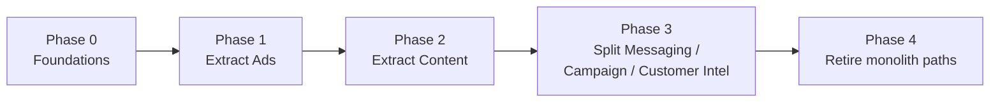

# Migration Plan

[← Back to index](./README.md)

**Status: Proposed.** A phased, incremental approach — each phase independently shippable, none requiring the whole target architecture to be decided before starting.

## Phase 0 — Foundations (do this before extracting anything)

Directly addresses the two highest-severity items in [KNOWN_RISKS_AND_TECHNICAL_DEBT.md](./KNOWN_RISKS_AND_TECHNICAL_DEBT.md):
- Establish real database migration files/tooling and reconstruct the current schema into version control — extracting a service without this means the new service starts with the same "unknown true schema" problem the monolith has today, just duplicated.
- Stand up basic automated testing for at least the shared choke-points already identified as high-leverage (`approveAndSendDecision`, `callClaude`, `authenticateUser`) — these are used by nearly everything and are the cheapest place to gain real confidence before touching anything else.
- Resolve environment separation (confirm or create a real staging setup) before any service has two versions running simultaneously during extraction.

**Risk if skipped:** every subsequent phase inherits an unversioned schema and zero test coverage, compounding the same debt into N new services instead of one.

## Phase 1 — Extract the Ads capability

Chosen first specifically because [TARGET_ARCHITECTURE_ALIGNMENT.md](./TARGET_ARCHITECTURE_ALIGNMENT.md) rates it "High confidence" — the most self-contained cluster in the current codebase, with the fewest cross-cutting dependencies to untangle. The one known exception (Custom Audience creation reading Customer Intelligence data directly) should be handled as a synchronous API call to the still-monolithic backend during this phase, not solved by moving Customer Intelligence data early.

**Rollback:** the new service can be disabled and the monolith's existing Ads actions re-enabled with no data migration to undo, provided the extracted service reads/writes the same tables rather than forking them.

## Phase 2 — Extract Content generation

The generation pipeline (brief → prompt → image/video) is fairly self-contained per [TARGET_ARCHITECTURE_ALIGNMENT.md](./TARGET_ARCHITECTURE_ALIGNMENT.md); Strategy generation's heavier dependency on business data should extract second, once the AI Gateway question (below) is resolved.

**Dependency:** should follow the AI Gateway decision (see "Cross-cutting concern," below), since Content is the heaviest AI-dependent capability outside Messaging.

## Phase 3 — Split Messaging / Campaign / Customer Intelligence

Deliberately last among the domain extractions, and deliberately grouped as one phase rather than three, because [TARGET_ARCHITECTURE_ALIGNMENT.md](./TARGET_ARCHITECTURE_ALIGNMENT.md) rates the boundaries between these three "Medium confidence" — they are the most genuinely coupled cluster in the current system (the auto-reply engine alone reads across all three). Attempting to split them before Phases 1-2 establish real inter-service call patterns and Phase 0's testing foundation would carry the highest risk in the whole plan.

**Specific risk from [KNOWN_RISKS_AND_TECHNICAL_DEBT.md](./KNOWN_RISKS_AND_TECHNICAL_DEBT.md):** the do-not-disturb enforcement gap that was fixed by funneling every send through one shared function (`approveAndSendDecision`) is a direct illustration of why this split needs care — a new send path introduced during this extraction that doesn't go through the equivalent shared check in the new architecture would silently reintroduce that exact defect.

## Cross-cutting concern to resolve before Phase 2: the AI Gateway question

`callClaude()` and its cost-logging are used by every AI-dependent action across every proposed service. Before extracting any AI-heavy capability, decide (see a proposed future ADR, not yet drafted in this pass): does each service call Anthropic directly with its own cost-logging, or does a shared internal "AI Gateway" service own this? The existing cost-observability pattern (see [OBSERVABILITY_AND_OPERATIONS.md](./OBSERVABILITY_AND_OPERATIONS.md)) is valuable and should not be lost or fragmented by whichever choice is made.

## Phase 4 — Retire monolithic paths

Once each capability is genuinely served by its extracted service and has run in parallel long enough to build confidence, remove the corresponding `case` blocks from `index.ts`. Not before — the monolith remains the source of truth for anything not yet extracted, and partial removal before a service is proven risks a capability gap with no fallback.

## What this plan deliberately does not commit to

- Exact service boundaries within Phase 3 (Messaging/Campaign/Customer Intelligence) — this is intentionally left to be decided closer to that phase, informed by what's actually learned extracting Ads and Content first
- A timeline — every phase's duration depends on Phase 0 decisions not yet made
- Whether the sibling project mentioned in [SYSTEM_CONTEXT.md](./SYSTEM_CONTEXT.md) (the Loyalty Passport app, sharing the same database) onboards before or after this plan's phases — its own architecture documentation (produced separately) should inform this before deciding
