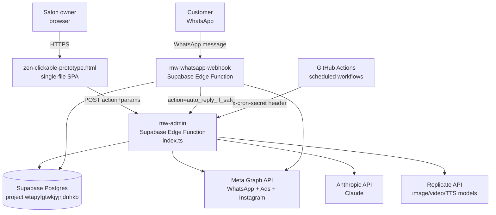

# System Context

[← Back to index](./README.md)

## What Zen is

Zen is a multi-tenant, AI-powered salon management console. MiniCuts FZCO (a children's hair salon in Dubai Silicon Oasis) is the first and, as of this writing, only active tenant — **[UNKNOWN — confirm with the team whether any other tenant has genuinely onboarded, since the codebase is built multi-tenant but has only been exercised against MiniCuts' real data]**.

The platform centralizes: WhatsApp marketing automation, customer intelligence (return-likelihood prediction), campaign management, Meta ad spend analysis and Custom Audience creation, AI-generated social content, and business analytics — all reasoning over the salon's real transaction and customer data rather than generic assumptions.

## The three real deployable units

There is no monorepo tooling and no shared build step between these three — they are three independently-deployed artifacts that happen to share one Supabase project.

1. **`zen-clickable-prototype.html`** — the entire frontend. One HTML file, inline `<style>` and `<script>`, no build step, no framework, no bundler. Every screen is a JS function that writes into a container div's `innerHTML`. See [CODEBASE_MAP.md](./CODEBASE_MAP.md).
2. **`index.ts`** — the entire backend. One Supabase Edge Function named `mw-admin`, ~13,400 lines, one giant `switch(action)` statement with 243 real cases (`grep -c '^      case "' index.ts`). See [CURRENT_ARCHITECTURE.md](./CURRENT_ARCHITECTURE.md).
3. **`mw-whatsapp-webhook-index.ts`** — a second, separate Supabase Edge Function. Receives Meta's inbound WhatsApp webhook events (messages, delivery/read receipts) and forwards processing to `mw-admin`.

Two more pieces exist outside these three files but are referenced by the backend and worth knowing about:

- **GitHub Actions workflows** in the same GitHub repo (`yasmint2825/Zen-Platform-Console`) that the backend dispatches via the GitHub API (`run_workflow` action, see [JOBS_AND_SCHEDULES.md](./JOBS_AND_SCHEDULES.md)): `daily_intelligence.yml`, `train_model.yml`, `generate_social_content.yml`, `cleanup_old_generations.yml`, `publish_scheduled_content.yml`, `metric_learnings.yml`. **[UNKNOWN — the contents of these workflow files were not part of this documentation pass; only their names and dispatch triggers are confirmed from index.ts]**.
- **A separate, related app** — referred to in prior project notes as the "Loyalty Passport app" (`index__8_.html`), which reads the *same* live Supabase database (`wtapyfgtwkjyjrjdnhkb`) but is a distinct, customer-facing surface. **[UNKNOWN — this app's source was not reviewed as part of this documentation pass; it is mentioned here only because it shares the same database and is relevant to any future service-boundary decision]**.

## Who/what talks to this system

| Actor | Direction | Via |
|---|---|---|
| Salon owner (or staff, role-gated) | Reads and writes everything | Frontend → `mw-admin` |
| Customer | Sends WhatsApp messages | Meta → `mw-whatsapp-webhook` → `mw-admin` |
| Meta Graph API | WhatsApp send/receive, Ads Manager, Instagram publishing | `mw-admin` calls out directly, no SDK |
| Anthropic API | Every AI reasoning/generation task | `mw-admin` calls out directly via `callClaude()` |
| Replicate API | Image generation, video generation, text-to-speech | `mw-admin` calls out directly |
| GitHub Actions | Scheduled jobs (daily intelligence, model training, content generation) | `mw-admin` dispatches via GitHub API; workflows call back into `mw-admin` |
| Supabase cron (pg_cron) | Periodic triggers | Calls `mw-admin` with `x-cron-secret` header for a fixed allow-list of actions (`send_due_scheduled`, `apply_ad_schedule`, `auto_reply_if_safe`, `generate_insights`, `label_outcomes`, `run_workflow` — `index.ts:2322`) |

## What's explicitly out of scope for this documentation pass

- The Loyalty Passport app's internal architecture (noted above)
- The contents of the 6 GitHub Actions workflow YAML files
- Any infrastructure-as-code for the Supabase project itself (RLS policies, database functions like `mw_run_readonly_query` and `mw_estimate_query_rows` referenced in `index.ts` are used but their SQL definitions live outside these three files and were not reviewed)
