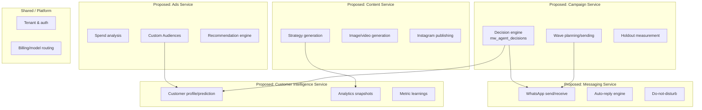

# Target Architecture Alignment

[← Back to index](./README.md)

**Status: Proposed, not decided.** Everything below maps the current, real capabilities (see [FUNCTIONAL_CAPABILITIES.md](./FUNCTIONAL_CAPABILITIES.md)) onto a plausible microservice decomposition, based on evidence of how the code is actually organized today. Where a clean boundary doesn't exist — which is common and expected in a flat architecture — that's stated directly rather than forced.

## Proposed service map

## Per-capability mapping and confidence

| Current capability | Proposed service | Confidence | Why |
|---|---|---|---|
| WhatsApp send/receive, auto-reply, DND | Messaging | High | Already conceptually cohesive; `approveAndSendDecision` is a natural single choke-point to become a real internal API |
| Campaign decisions, wave sending, holdout | Campaign | Medium | Genuinely coupled to Messaging (it sends through it) and to Customer Intelligence (it reads predictions) — a clean cut here needs an explicit internal API, not just a folder split |
| Customer profile, prediction, analytics | Customer Intelligence | High | Reads are used by nearly every other capability; strong candidate to be a genuine "core data" service other services call rather than query directly |
| Monthly strategy, content generation, publishing | Content | Medium | Strategy generation reads business data extensively; the generation pipeline itself (brief → prompt → image) is fairly self-contained and a good extraction candidate on its own |
| Ad spend analysis, Custom Audiences, recommendations | Ads | High | Already the most self-contained cluster in the current file — almost all Ads actions call `resolveMetaAds()` and nothing outside the Ads cluster, with one exception: Custom Audience creation reads Customer Intelligence data directly |
| Tenant/auth, billing/model routing | Platform (shared) | High | `authenticateUser`, `getUserTenantRole`, `mw_llm_calls` cost tracking are used by literally everything; this is the one boundary every other service will genuinely depend on |

## Capabilities that do NOT map cleanly — surfaced honestly, not forced

- **The AI auto-reply engine reads customer profile, price list, staff rota, and business facts simultaneously** to build one prompt. Splitting Messaging from Customer Intelligence means this one function becomes a cross-service call assembling context from at least two services before a reply can be generated — a real latency and reliability consideration, not a trivial extraction.
- **`callClaude()` and its cost-logging (`mw_llm_calls`) are used by every single AI-dependent action across every proposed service boundary.** This strongly suggests an early, cross-cutting "AI Gateway" concern rather than something owned by any one domain service — worth its own explicit decision, not an afterthought.
- **The Meta Strategy Library's Custom Audience creation reads Customer Intelligence data (transactions, profiles) directly and calls Meta's API directly** — it doesn't cleanly belong to either Ads or Customer Intelligence alone under the mapping above.

## What this document deliberately does not do

It does not propose a final decision. See [ADR-0002-SERVICE-BOUNDARIES.md](./adr/ADR-0002-SERVICE-BOUNDARIES.md) for where that decision should actually be recorded, and [MIGRATION_PLAN.md](./MIGRATION_PLAN.md) for a proposed sequence that doesn't require deciding everything above up front.
