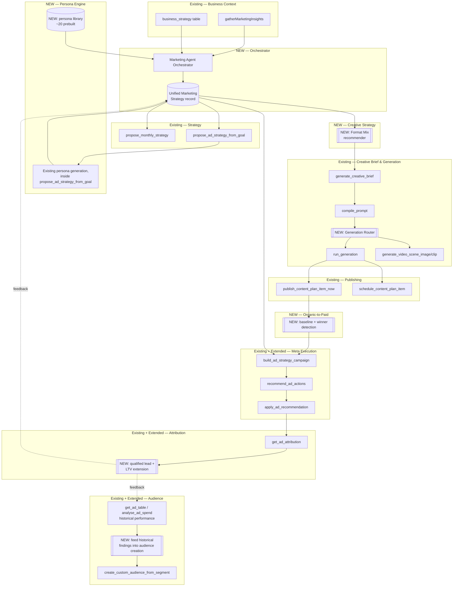
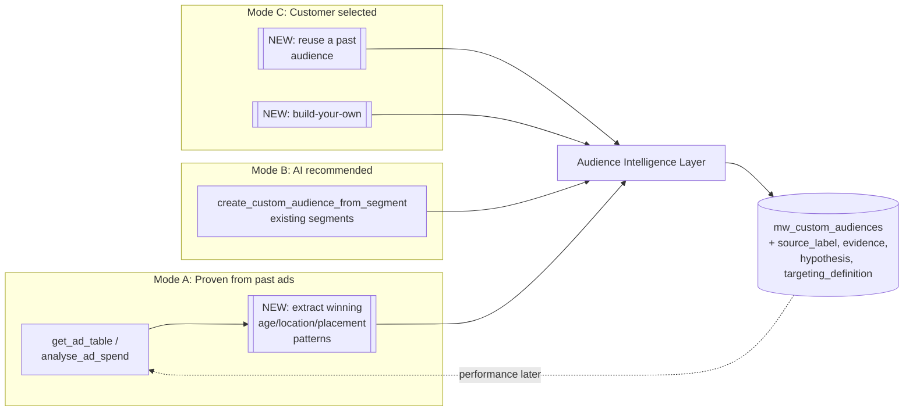
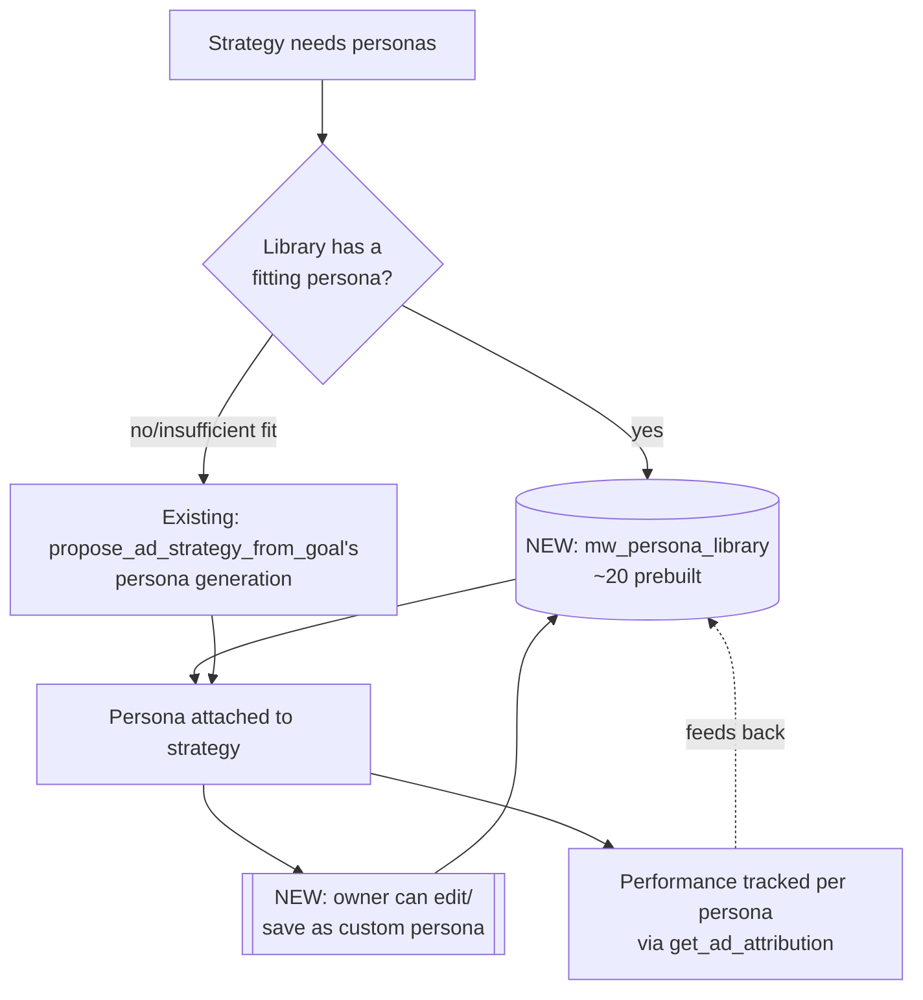
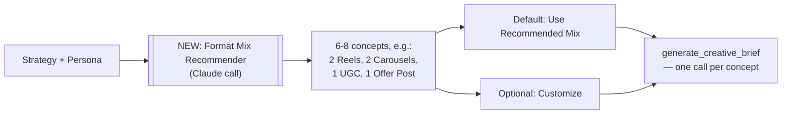
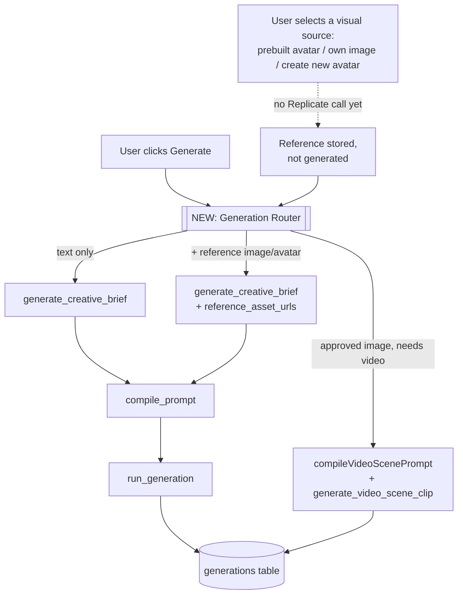
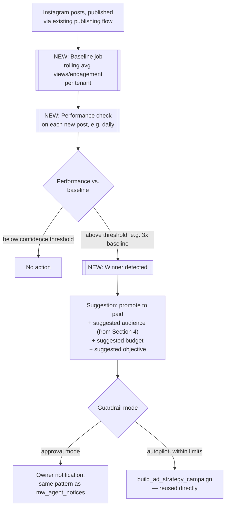
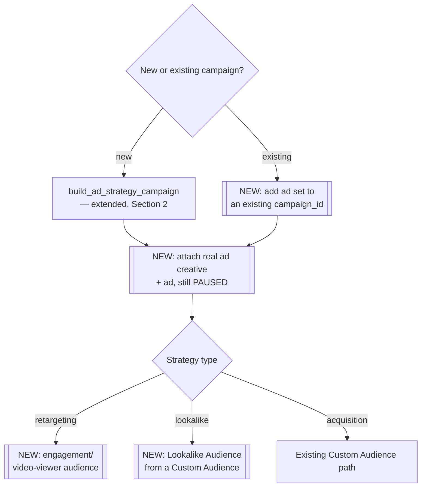
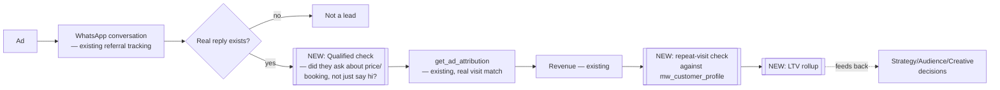
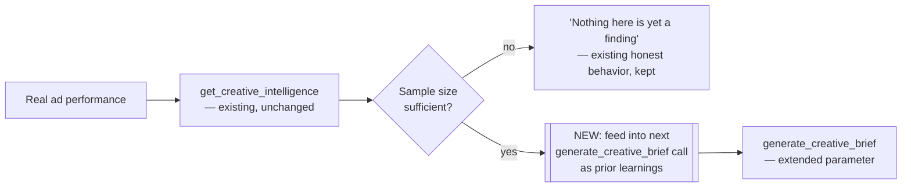
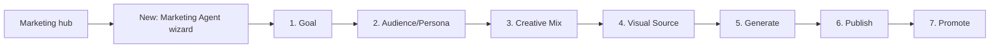

# Zen Marketing Agent — Orchestration Architecture & Implementation Plan

**Status: Architecture and plan only. No implementation in this document, per instruction.**
**Source of truth:** `zen-marketing-agent-requirement-matrix.md` (previous deliverable). Every reuse decision below cites the real function/action it refers to.

---

## 1. Final System Architecture

The core insight from the requirement matrix: almost every box below already exists as working code. The architecture's job is the orchestration layer connecting them — shown as the dashed boxes — not the boxes themselves.



**Reading this diagram:** every solid box is real, existing code. Every dashed/NEW box is genuinely new work. The orchestrator and the Unified Marketing Strategy record are the only structurally new "spine" — everything else is either reused as-is or extended.

---

## 2. Existing-Capability Reuse Map

| Component | Decision | Reasoning |
|---|---|---|
| `gatherMarketingInsights()` | **Keep as-is** | Already the real, shared business-context source for both `propose_monthly_strategy` and `propose_ad_strategy_from_goal`. No change needed — the orchestrator calls it once and passes the result forward, rather than each stage re-fetching it |
| `propose_monthly_strategy` | **Keep as-is** | This is the *content* strategy generator (organic posts). Stays separate from `propose_ad_strategy_from_goal` deliberately — a monthly content plan and a paid-goal campaign are genuinely different asks with different inputs (see Schema, Section 3, for how they both feed the same record without merging) |
| `propose_ad_strategy_from_goal` | **Extend** | Currently generates personas *inline*, disconnected from a reusable library. Extend to: (a) check the persona library first (Section 5) before generating from scratch, (b) write its output into the Unified Marketing Strategy record instead of returning a standalone object the frontend has to separately track |
| `create_custom_audience_from_segment` | **Extend** | Add a `source_label` and `evidence` field to what it persists (currently `mw_custom_audiences` has no such column — real schema gap, see Section 4). Add a new `source: "proven"` path that accepts findings from historical analysis rather than only fixed segment definitions |
| `get_creative_intelligence` | **Keep as-is, wrap** | The analysis itself is real and sound. Wrap it: its output currently isn't *consumed* anywhere automatically — the orchestrator should read it as an input to Creative Brief generation (Section 12), not just display it |
| `classify_ad_creative` | **Keep as-is** | Real, correctly scoped. No change |
| `generate_creative_brief` | **Extend** | Currently takes `user_request`, `platform`, `aspect_ratio`, `target_segment`. Extend the parameter set to accept `persona_id`, `strategy_id`, `creative_concept_id` (from the new Format Mix layer) — additive, backward compatible, existing callers unaffected |
| `compile_prompt` | **Keep as-is** | Already correctly pulls Brand DNA into every compiled prompt. No change needed — it already receives everything it needs once `generate_creative_brief`'s brief is richer |
| `run_generation` | **Keep as-is** | Genuinely a clean adapter already. The Generation Router (Section 7) sits *in front of* this, not inside it |
| Video generation flow (`generate_video_scene_image`/`_clip`, `compileVideoScenePrompt`) | **Keep as-is** | Already exactly the "approved image → video prompt → Replicate video" chain the spec asks for. No change |
| Publishing/scheduling (`publish_content_plan_item_now`, `schedule_content_plan_item`, `list_calendar_items`) | **Keep as-is** | Confirmed complete in the requirement matrix. The wizard (Section 14) calls these directly; no wrapping needed |
| `build_ad_strategy_campaign` | **Extend** | Currently creates campaign + ad sets only, no creative/ad attachment (a deliberate boundary when built). Extend to accept an optional `generation_id` per persona and, when present, create the real ad creative + ad, still respecting the explicit-PAUSED-at-every-level safety rule already in place |
| `recommend_ad_actions` | **Keep as-is** | Real, working, already the analysis half of the guardrail system. No change |
| `apply_ad_recommendation` | **Keep as-is** | Real, working, already the explicit-approval half. No change. This function is the actual proof point that "LLM never directly executes Meta" is already true in this codebase — preserve it exactly |
| `get_ad_attribution` | **Extend** | Add a `qualified` boolean and LTV rollup (Section 11) — additive fields, existing callers unaffected |

**Nothing on this list is Replace.** This is the deliberate outcome of "reuse first" — every existing piece is sound enough to extend rather than rebuild.

---

## 3. Unified Marketing Strategy Schema

A single record type that both the content-strategy path (`propose_monthly_strategy`) and the ad-strategy path (`propose_ad_strategy_from_goal`) write into, so the orchestrator and the wizard have one thing to read regardless of which strategy type is active.

```
MarketingStrategy {
  id: uuid
  tenant_id: text
  strategy_type: "content" | "ad_goal" | "combined"

  // Goal
  goal: {
    description: text                    // free text, e.g. "80 new customers"
    goal_customers: int | null
    budget_aed: numeric | null
    timeframe_days: int | null
    location_radius_km: numeric | null   // NEW field, currently missing per matrix
  }

  // Strategy
  strategy: {
    named_strategy_keys: text[]          // e.g. ["lapsed_winback", "high_value_hunter"]
    core_campaign: text
    key_messages: text[]
    feasibility_note: text
    confidence: "high" | "medium" | "low"
  }

  // Historical learnings (NEW — the explicit gap being closed)
  historical_context: {
    source_actions_used: text[]          // e.g. ["get_ad_table", "analyse_ad_spend"]
    findings_applied: text[]             // plain-language findings that influenced this strategy
    as_of: timestamptz
  }

  // Audience plan
  audiences: [{
    audience_id: uuid                    // FK to mw_custom_audiences
    source_label: "proven" | "ai_recommended" | "customer_selected"
    evidence: text
    is_hypothesis: boolean
  }]

  // Personas
  personas: [{
    persona_id: uuid                     // FK to persona library, or null if one-off
    is_from_library: boolean
    name: text
    who_they_are: text
    targeting: { age_min, age_max, radius_km, approach }
    creative_angle: text
    is_hypothesis: boolean
  }]

  // Creative mix (NEW)
  creative_mix: [{
    concept_id: uuid
    format: "reel" | "carousel" | "static" | "ugc" | "offer" | "talking_avatar" | "trend"
    persona_id: uuid | null
    brief_id: uuid | null                // FK to creative_briefs once generated
    status: "planned" | "generating" | "ready" | "published"
  }]

  // Promotion plan
  promotion: {
    mode: "organic_only" | "wait_for_winner" | "add_to_existing_campaign" | "new_campaign" | "autopilot"
    campaign_id: text | null             // real Meta campaign ID once built
  }

  // Optimization rules (feeds Section 13)
  optimization_rules: {
    max_budget_increase_percent: numeric
    max_incremental_spend_aed: numeric
    min_data_threshold_days: int
    mode: "recommend_only" | "approval" | "autopilot"
  }

  status: "draft" | "proposed" | "approved" | "active" | "archived"
  created_at, updated_at
}
```

**Why one schema, not two:** `propose_monthly_strategy` and `propose_ad_strategy_from_goal` remain separate *generators* (Section 2 — Keep as-is / Extend, not merged), but both write their output into this same shape. This is what lets the wizard (Section 14) show one coherent journey regardless of which generator produced the strategy.

---

## 4. Audience Intelligence Architecture



**The specific gap being closed:** today, `analyse_ad_spend` and `get_ad_table` produce real, evidenced findings (e.g. "the 25-34 age group in DSO produces lower CAC") but that finding just sits in a chat response — nothing turns it into a new Custom Audience. The new `EXTRACT` step is a small, targeted addition: a function that reads `analyse_ad_spend`'s own structured output (it already returns `campaigns`/`ads`/`adsets` with real numbers) and proposes a segment definition from it, which then goes through the *same* `create_custom_audience_from_segment` path already built — no new audience-creation mechanism, just a new *source* feeding the existing one.

**Schema addition required:** `mw_custom_audiences` currently has no `source_label`, `evidence`, or `is_hypothesis` column — this is a real, small migration, not a redesign.

---

## 5. Persona Engine



**Design decision:** do not throw away the existing generation logic — it's real and grounded in actual business data, which a static library entry can't be. Instead, the library is checked *first* as a fast path (avoiding an unnecessary Claude call when a known-good persona already fits), and generation remains the fallback for anything the library doesn't cover. Every persona — library or generated — gets an `is_from_library` flag and, critically, every persona used gets its real performance tracked back (via the extended `get_ad_attribution`, Section 11), so the library itself improves over time rather than staying static.

**New table required:** `mw_persona_library` — seeded with ~20 personas at launch (a genuine content task, not just schema), each tagged by business type/vertical so it can be filtered relevantly rather than shown as one flat list of 20 for every tenant.

---

## 6. Creative Strategy Layer (Format Mix)

**Confirmed NOT STARTED in the requirement matrix — this is genuinely new.**



A new, narrowly-scoped Claude call: given the strategy and personas already decided, propose a format mix, each concept carrying enough detail (format, persona attached, angle) to become a `generate_creative_brief` call directly. No new generation infrastructure — this produces the *inputs* to the existing brief system, one concept at a time.

---

## 7. Replicate Generation Architecture — the Generation Router



**The specific principle from the spec, honored exactly:** *"Selecting an avatar/photo should never itself trigger Replicate."* This is why `STORE` in the diagram has no arrow into any Replicate-calling function — selecting a reference only sets which `reference_asset_urls` get passed to `compile_prompt` *later*, at the moment Generate is actually clicked. The Router is genuinely thin: it decides which of the three already-real paths (`generate_creative_brief` alone, with a reference image, or the video chain) applies, then calls straight into existing code. It does not reimplement any of them.

**What every call carries**, per the spec's list — checked against what already exists: Brand DNA ✅ already in `compilePromptForBrief`; Strategy/Persona/Audience intent — requires the `generate_creative_brief` parameter extension from Section 2; Creative concept/Format — comes from the new Format Mix layer (Section 6); Negative constraints — already exists (`negative_guidance` in `compile_prompt`'s output); Aspect ratio — already a real parameter.

---

## 8. Publishing Architecture

No new architecture needed — confirmed complete in the requirement matrix. The wizard's Publish step (Section 14) calls `publish_content_plan_item_now` / `schedule_content_plan_item` / `list_calendar_items` directly, exactly as the existing content-plan review screen already does. Approval mode already exists via `approve_content_plan_item`.

---

## 9. Organic-to-Paid Architecture

**Confirmed NOT STARTED — fully new design.**



**Design notes:** "confidence threshold" needs a real, defensible definition — proposed: a post needs to clear both a minimum absolute engagement count (avoiding false positives on a low-follower account where 3x-of-almost-nothing is still almost nothing) and a multiple of the account's own rolling baseline, mirroring the `MIN_ARM`-style honesty already used in `recommend_ad_actions` ("not enough data yet" as a legitimate answer). The suggested audience should draw from Section 4's Audience Intelligence layer, not invent a new targeting mechanism. Building the actual paid campaign reuses `build_ad_strategy_campaign` unchanged.

---

## 10. Meta Campaign Execution Architecture (Extended)



Every new box here is additive to `build_ad_strategy_campaign`, not a parallel campaign-creation system. The explicit-PAUSED-at-every-level safety behavior (verified against Meta's real documented cascade behavior when this was first built) is preserved unchanged across every one of these new paths — this is a hard constraint carried forward, not renegotiated per feature.

---

## 11. Closed-Loop Attribution (Extended)



**"Qualified lead" definition (flagged as an assumption per the spec's own instruction to mark ambiguity rather than silently decide):** proposed as a message containing genuine purchase-intent signal (a price question, a booking request, a specific service mention) versus a bare greeting — this can reuse the same intent-classification pattern already proven in `handleAutoReply()`'s hand-off detection, not a new classifier. **This needs explicit confirmation before Phase 7, not an assumption baked into the schema.**

**LTV calculation:** proposed as trailing revenue over a rolling window (e.g. 12 months) per customer, already computable from `mw_transactions` — no new data source needed, just a new aggregation, following the same real-computation-over-guessed-heuristic pattern used throughout this codebase (e.g. the `get_customer_activity_summary` fix from earlier in this project).

---

## 12. Creative Intelligence Feedback Loop



The only new work: `generate_creative_brief`'s extended parameters (Section 2) include an optional `prior_learnings` field, populated by querying `get_creative_intelligence`'s own output for patterns matching the current persona/format/placement before compiling the brief. `get_creative_intelligence` itself needs no change — its honest "not enough data" behavior is a real, deliberate feature, explicitly preserved rather than pressured into producing a finding prematurely.

---

## 13. Autopilot Architecture

No new execution mechanism — `recommend_ad_actions` (analysis) → `apply_ad_recommendation` (explicit write) already *is* the real, working "approval mode." The new work is purely in the policy layer that decides whether `apply_ad_recommendation` requires a click or can fire automatically:

```
PolicyCheck(recommendation, optimization_rules) {
  if recommendation.budget_change_percent > optimization_rules.max_budget_increase_percent:
    require_approval = true
  if recommendation.incremental_spend_aed > optimization_rules.max_incremental_spend_aed:
    require_approval = true
  if recommendation.days_of_data < optimization_rules.min_data_threshold_days:
    block_entirely = true          // matches existing FAIR_RUN_DAYS logic, not new
  if recommendation.verdict in ["pause", "reduce"] and mode == "autopilot":
    require_approval = true        // destructive actions never fully automatic, regardless of mode
}
```

This sits as a thin check *in front of* `apply_ad_recommendation`, called by the orchestrator — `apply_ad_recommendation` itself doesn't change. `optimization_rules` comes from the Unified Marketing Strategy record (Section 3), set once per strategy rather than globally, so different campaigns can carry different risk tolerances.

---

## 14. Responsive UX Architecture

**Explicit constraint honored: main navigation stays exactly as-is (Home/Campaigns/ZenWhatsApp/Marketing/Insights/Settings).** The wizard is a new flow reachable from Marketing, not a nav restructure.



**Desktop:** progress/step list left (reusing the existing `wizSteps()` component already used by every other wizard in this app — Campaigns, Monthly Plan, Content flow — not a new component), one focused decision on the right.
**Mobile:** the app's existing responsive tiering already collapses multi-column layouts to single-column below a breakpoint (confirmed working from an earlier session's responsive-width fix) — the wizard reuses this rather than needing bespoke mobile logic. Sticky Back/Continue is the one genuinely new piece of CSS needed, since existing wizards use inline (non-sticky) action buttons.

**This wizard supersedes, not duplicates, the existing separate flows** — `goalStrategyFlow()` (Section on `propose_ad_strategy_from_goal`) and `contentFlow()` (the quick single-post flow) become *entry points into* Steps 1 and 5 of this wizard respectively, rather than remaining fully separate journeys. This needs explicit product confirmation before Phase 2, since it changes how two already-shipped, tested flows are reached.

---

## Implementation Plan

### Phase 1 — Unification/Foundation
- **Objective:** Establish the Unified Marketing Strategy schema and a thin orchestrator; make `propose_ad_strategy_from_goal` and `propose_monthly_strategy` write into it.
- **Modules affected:** `index.ts` (new schema handling, extend two existing actions), new table `mw_marketing_strategy`
- **Reuse:** `gatherMarketingInsights`, both strategy generators, unchanged in their reasoning — only their output target changes
- **New:** orchestrator functions, schema validation
- **DB changes:** `mw_marketing_strategy` table; add `source_label`/`evidence`/`is_hypothesis` to `mw_custom_audiences`
- **Acceptance criteria:** a strategy generated by either path is readable as one consistent shape by a single frontend function
- **Risks:** the two generators have genuinely different inputs (content vs. ad goal) — forcing a shared schema too early could distort one to fit the other; validate against real output from both before finalizing field names

### Phase 2 — Responsive Wizard
- **Objective:** Build the 7-step wizard shell, reusing `wizSteps()`
- **Reuse:** existing wizard CSS/JS pattern, `goalStrategyFlow()` and `contentFlow()` as the logic behind Steps 1 and 5
- **New:** step navigation shell, sticky mobile actions, entry point from Marketing hub
- **Acceptance criteria:** desktop and mobile both tested via the existing Playwright-based verification pattern already used throughout this project
- **Risks:** absorbing two already-shipped flows into one wizard risks regressing tested behavior — needs the same rigor (structural check, real end-to-end test) applied to every prior change in this project, not less because it's "just wiring"

### Phase 3 — Replicate Generation (Generation Router + Format Mix)
- **Objective:** Build the Format Mix recommender and the thin Generation Router; extend `generate_creative_brief`'s parameters
- **Reuse:** `generate_creative_brief`, `compile_prompt`, `run_generation`, video chain — all unchanged internally
- **New:** Format Mix Claude call, Router dispatch logic
- **Acceptance criteria:** a persona's creative angle demonstrably appears in the compiled prompt for its generated asset (currently does not — confirmed gap)

### Phase 4 — Publishing
- **Objective:** Wire the wizard's Publish step to existing functions
- **Reuse:** 100% — `publish_content_plan_item_now`, `schedule_content_plan_item`, `list_calendar_items`, `approve_content_plan_item`
- **New:** none functionally; only the wizard-step UI wrapper
- **Risks:** minimal — this is the lowest-risk phase given full reuse

### Phase 5 — Meta Execution (extend `build_ad_strategy_campaign`)
- **Objective:** Add creative/ad attachment, existing-campaign support, retargeting, lookalikes
- **Reuse:** `build_ad_strategy_campaign`'s campaign/ad-set creation and its explicit-PAUSED safety pattern, unchanged
- **New:** ad creative creation call, lookalike audience creation, existing-campaign ad-set-add path
- **Risks:** highest real-money risk in the whole plan — every new path here needs the same explicit-PAUSED verification the original function received, tested against real Meta documentation before shipping, not assumed to inherit safety automatically

### Phase 6 — Organic-to-Paid
- **Objective:** Baseline tracking + winner detection + promotion suggestion
- **New:** entirely new — baseline job, comparison logic, suggestion generation
- **Reuse:** `build_ad_strategy_campaign` for the actual promotion once approved
- **Risks:** confidence threshold needs real tuning against real account data before trusting it — expect the first several "winners" to need manual sanity-checking

### Phase 7 — Attribution & Learning
- **Objective:** Qualified-lead classification, LTV, feedback loops into strategy/audience/creative
- **Reuse:** `get_ad_attribution`, `mw_transactions`, `handleAutoReply`'s intent-classification pattern for qualification
- **New:** LTV aggregation, feedback wiring
- **Blocked pending:** the "qualified lead" definition (Section 11) needs explicit product confirmation, not an assumption, before this phase starts

### Phase 8 — Autopilot
- **Objective:** Policy engine in front of `apply_ad_recommendation`
- **Reuse:** `recommend_ad_actions`, `apply_ad_recommendation`, `FAIR_RUN_DAYS`/`MIN_ARM` thresholds — all unchanged
- **New:** `PolicyCheck` function, `optimization_rules` read from the strategy record

### Phase 9 — QA / Gap Audit
- Re-run the full requirement matrix against what Phases 1-8 actually shipped, using the same real-evidence-only standard as the original matrix — no requirement marked COMPLETE without a citable action/file, matching every other verification pass in this project's history.

---

## Updated Requirement Matrix (Post-Architecture)

| Requirement | Prior Status | New Status | Why |
|---|---|---|---|
| Strategy/Persona/Audience/Creative Brief connected | 🟡 PARTIAL | **READY** (pending Phase 1-3) | Architecture fully specifies the connection; no unknowns remain |
| Audience source labeling | ⬜ NOT STARTED | **READY** (pending Phase 1) | Small, well-defined schema addition |
| Historical performance → audience creation | 🟡 PARTIAL | **READY** (pending Phase 4/Section 4) | Extraction function is narrowly scoped and well-understood |
| Persona library (~20 prebuilt) | ⬜ NOT STARTED | **PARTIAL — BLOCKED on content** | Architecture is ready; the ~20 real personas themselves need to be authored, which is a content task, not purely engineering |
| Format Mix / Creative Strategy layer | ⬜ NOT STARTED | **READY** (pending Phase 3) | Well-scoped, single new Claude call |
| Organic-to-Paid | ⬜ NOT STARTED | **PARTIAL — BLOCKED on threshold tuning** | Architecture is sound; confidence threshold cannot be finalized without real account data to tune against |
| Ad/creative attachment to campaigns | ⬜ (deliberate boundary) | **READY** (pending Phase 5) | Highest-risk phase — architecturally ready, execution needs extra care |
| Lookalikes | ⬜ NOT STARTED | **READY** (pending Phase 5) | Standard Meta API capability, same safety pattern applies |
| Qualified lead / LTV | ⬜ / 🟡 | **BLOCKED** | Needs explicit product decision on "qualified" definition before any code |
| Autopilot (true, non-approval) | 🟡 PARTIAL | **PARTIAL — by design** | Policy engine allows it, but destructive actions remain approval-gated regardless of mode, per the architecture's own hard constraint — this is intentional, not a gap |
| Minimal 3-tab nav | ⬜ (real divergence) | **explicitly deferred** | Per this document's own instruction: navigation stays as-is; not part of this plan at all |

**One thing this plan does not resolve, and shouldn't try to:** whether absorbing `goalStrategyFlow()` and `contentFlow()` into the new wizard (Section 14) is the right call, versus keeping them as fast, separate shortcuts alongside a fuller wizard. That's a real product tradeoff worth a direct decision before Phase 2 starts, not something to resolve by default.

---

## Phase 1 Status — Unification/Foundation (Implemented)

**Implemented:**
- `mw_marketing_strategy` table (new — SQL below), with `persistMarketingStrategy()` as the one shared write path
- `propose_ad_strategy_from_goal` now writes into it additively (`marketing_strategy_id` added to its response; existing `strategy`/`goal_customers`/`budget_aed` fields unchanged)
- `propose_monthly_strategy` now writes into it via a pointer (`source_ref.content_strategy_id`), not duplicated content — existing `strategy` field (the full `monthly_content_strategy` row) unchanged
- New `get_marketing_strategy` action — reads the latest or a specific unified record, regardless of which generator produced it
- `mw_custom_audiences` extended with `source_label`, `evidence`, `is_hypothesis`, `targeting_definition` — populated by `create_custom_audience_from_segment` for all three existing segments (`evidence` reuses the segment's existing descriptive text; `is_hypothesis` is true only for `high_value`, matching its own existing UI language)

**Verified:**
- Compiles cleanly (single pre-existing, unrelated error, consistent throughout this project's history)
- Existing frontend callers (`planRecommend()`, `goalPropose()`) traced directly — both read only their own known fields and are unaffected by additive new ones
- **Not verified: a live database round-trip.** This sandbox has no live Supabase connection. `persistMarketingStrategy()` is written defensively (failure logs and returns null rather than throwing, so a persistence failure can never break either generator's existing, working response) — but the first real insert against the actual database is genuinely unverified until deployed and exercised for real.

**Not yet done (correctly deferred to later phases per the plan, not overlooked):**
- The orchestrator itself (a function that *reads* `gatherMarketingInsights` once and hands it to whichever generator is chosen) doesn't exist yet — Phase 1 made both generators writeable into one shape, but didn't yet build the layer that would call them through one entry point. Worth a decision: is a thin orchestrator function needed before Phase 2, or does the wizard just call the existing two actions directly? Flagging as open rather than assuming.
- `creative_mix`, `historical_context` (for ad_goal strategies), and real `optimization_rules` defaults are schema-ready but empty/minimal until Phases 3, 4, and 8 populate them — exactly as planned.

## Migrations Required (Phase 1)

```sql
create table if not exists mw_marketing_strategy (
  id uuid primary key default gen_random_uuid(),
  tenant_id text not null,
  strategy_type text not null check (strategy_type in ('content', 'ad_goal', 'combined')),
  source_ref jsonb not null default '{}',
  core_campaign text,
  key_messages jsonb not null default '[]',
  personas jsonb not null default '[]',
  audiences jsonb not null default '[]',
  creative_mix jsonb not null default '[]',
  promotion jsonb not null default '{}',
  optimization_rules jsonb not null default '{}',
  historical_context jsonb,
  status text not null default 'proposed',
  created_at timestamptz not null default now(),
  updated_at timestamptz not null default now()
);
create index if not exists mw_marketing_strategy_tenant_idx on mw_marketing_strategy(tenant_id, created_at desc);

alter table mw_custom_audiences
  add column if not exists source_label text,
  add column if not exists evidence text,
  add column if not exists is_hypothesis boolean default false,
  add column if not exists targeting_definition jsonb;
```

